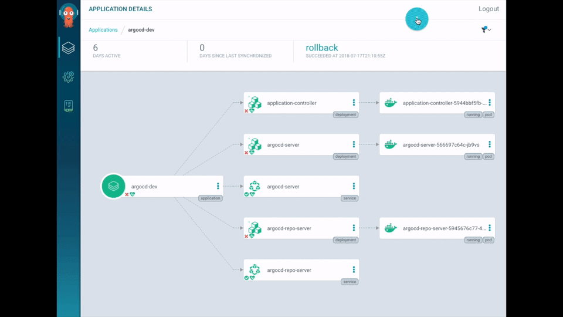

# GitOps with Django & ArgoCD - Part I


This is Django Starter Template which will be used in GitOps demo using ArgoCD.


### Prerequisites

- [x] [Docker](https://www.docker.com/) - Docker helps developers bring their ideas to life by conquering the complexity of app development.


- [x] [Kubernetes](https://kubernetes.io/) - also known as K8s, is an 
 open-source system for automating deployment, scaling, and management of containerized applications.


- [x] [ArgoCD](https://argo-cd.readthedocs.io/en/stable/) - Argo CD is implemented as a kubernetes controller which continuously monitors running applications and compares the current, live state against the desired target state


### ArgoCD Installation

Follow the official docs of ArgoCD installation.

* Before that make sure Docker Desktop or Minikube is running on your machine with K8s enabled.

- [https://argo-cd.readthedocs.io/en/stable/](https://argo-cd.readthedocs.io/en/stable/)

#### Commands

```
kubectl create namespace argocd
kubectl apply -n argocd -f https://raw.githubusercontent.com/argoproj/argo-cd/stable/manifests/install.yaml
```



### DockerHub

Images are being hosted in DockerHub. 
 - [https://hub.docker.com/r/mukulmantosh/app-sample](https://hub.docker.com/r/mukulmantosh/app-sample)

#### Dockerfile

```dockerfile
FROM python:3.10-alpine

# set work directory
WORKDIR /usr/src/app

# set environment variables
ENV PYTHONDONTWRITEBYTECODE 1
ENV PYTHONUNBUFFERED 1

# install dependencies
RUN pip install --upgrade pip
COPY ./requirements.txt /usr/src/app
RUN pip install -r requirements.txt

# copy project
COPY . /usr/src/app

EXPOSE 8000

RUN python manage.py migrate
RUN python manage.py create_dummy_user

CMD ["python", "manage.py", "runserver", "0.0.0.0:8000"]
```

### Flow

- Make sure Docker is Up and Running
- Build & Upload the image to docker registry
- Clone this repository : [https://github.com/mukulmantosh/django-app-k8s](https://github.com/mukulmantosh/django-app-k8s)
- Update the manifest file ```argo-app.yml``` 
- Updated the manifest files pointed in the ```dev``` path
- Make sure to point properly to the correct image registry
- Next, follow the steps given in the ```django-app-k8s``` repository

## References

If you are interested to know more about GitOps & ArgoCD, then you can follow the below links.

- [Understanding Argo CD: Kubernetes GitOps Made Simple](https://codefresh.io/learn/argo-cd/)
- [Guide To GitOps by WeaveWorks](https://www.weave.works/technologies/gitops/) 