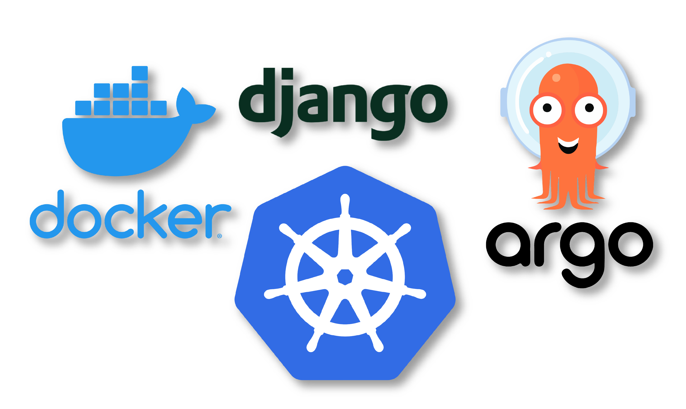

# GitOps with Django & ArgoCD - Part I

This is Django Starter Template which will be used in GitOps demo using ArgoCD.

### Prerequisites

- [x] [Docker](https://www.docker.com/) - Docker helps developers bring their ideas to life by conquering the complexity of app development.

- [x] [Kubernetes](https://kubernetes.io/) - also known as K8s, is an 
 open-source system for automating deployment, scaling, and management of containerized applications.

- [x] [ArgoCD](https://argo-cd.readthedocs.io/en/stable/) - Argo CD is implemented as a kubernetes controller which continuously monitors running applications and compares the current, live state against the desired target state

### DockerHub
 - [https://hub.docker.com/r/mukulmantosh/ecommerce-fastapi](https://hub.docker.com/r/mukulmantosh/ecommerce-fastapi)

## References

If you are interested to know more about AWS with Python, then you can follow the below links.

- [Developing Serverless APIs using AWS Toolkit](https://www.jetbrains.com/pycharm/guide/tutorials/intro-aws/)
- [Developing Django Application using AWS NICE DCV, high-performance remote desktop and application streaming](https://www.jetbrains.com/pycharm/guide/tutorials/django-aws/) 